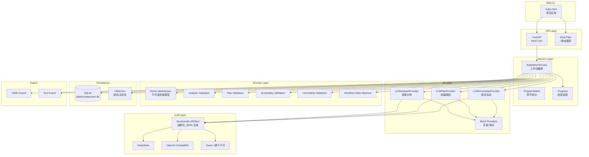
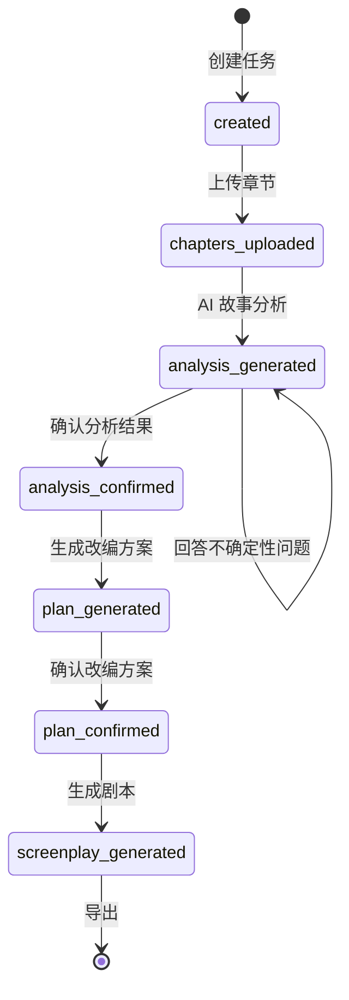
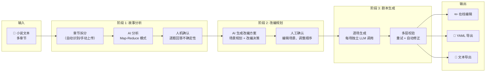
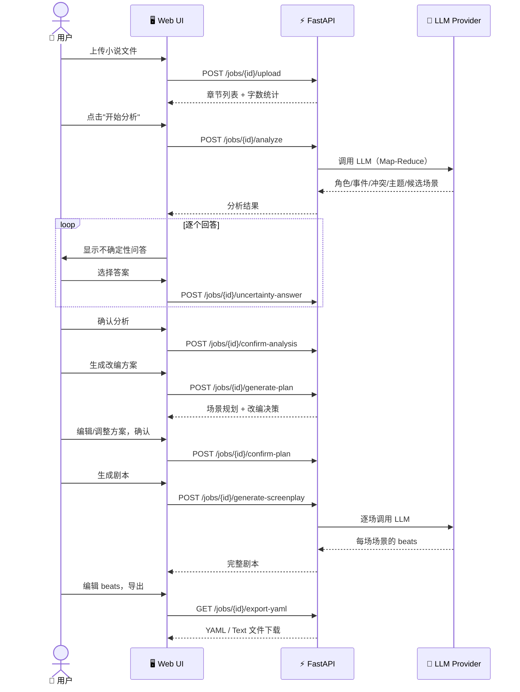

# ScriptWeaver

[](https://www.python.org/downloads/)
[](LICENSE)
[](tests/)

**Human-in-the-loop AI 小说→剧本改编引擎**。将长篇小说的章节文本，通过多阶段 AI 分析与结构化改编规划，自动生成可编辑的分场剧本草稿。

> 📺 **视频演示：** [ScriptWeaver 项目介绍与演示](https://www.bilibili.com/video/BV1QhEb6JENK/)

---

## 目录

- [快速开始](#快速开始)
- [配置详解](#配置详解)
- [核心架构](#核心架构)
- [处理流程](#处理流程)
- [API 接口](#api-接口)
- [项目结构](#项目结构)
- [核心创新](#核心创新)
- [程序健壮性](#程序健壮性)
- [导出格式](#导出格式)

---

## 快速开始

### 1. 环境准备

```bash
# 要求 Python 3.11+
python3 --version  # >= 3.11

# 克隆项目
git clone https://github.com/douzhenyu/ScriptWeaver.git
cd ScriptWeaver

# 创建虚拟环境并安装
python3 -m venv .venv
source .venv/bin/activate
python3 -m pip install -e ".[dev]"
```

### 2. 启动服务

```bash
# Mock 模式（无需 API Key，快速体验）
python run.py

# 真实 LLM 模式（DeepSeek）
export SCRIPTWEAVER_API_KEY="sk-你的密钥"
python run.py
```

```bash
# 验证服务
curl http://127.0.0.1:8000/health
# → {"status":"ok"}
```

打开 `http://127.0.0.1:8000` 进入 Web UI。

### 3. Docker 部署

```bash
# 构建并启动（Mock 模式）
docker compose up -d

# 使用真实 LLM
export SCRIPTWEAVER_API_KEY="sk-..."
docker compose up -d
```

访问 `http://localhost:8000`。

> **注意:** docker-compose.yml 中的环境变量需取消注释并填入真实密钥才能启用 LLM。

---

## 配置详解

### 环境变量

| 变量 | 默认值 | 说明 |
|---|---|---|
| `SCRIPTWEAVER_API_KEY` | (空) | LLM API 密钥。不设置则使用 Mock 模式 |
| `SCRIPTWEAVER_BASE_URL` | `https://api.deepseek.com` | OpenAI 兼容 API 地址 |
| `SCRIPTWEAVER_MODEL` | `deepseek-chat` | 模型名称 |
| `SCRIPTWEAVER_PORT` | `8000` | 本地 Web 服务监听端口 |

**支持的 LLM 服务：** DeepSeek、OpenAI、Qwen（通义千问），以及任何 OpenAI 兼容 API。

```bash
# 阿里云通义千问
export SCRIPTWEAVER_API_KEY="sk-..."
export SCRIPTWEAVER_BASE_URL="https://dashscope.aliyuncs.com/compatible-mode/v1"
export SCRIPTWEAVER_MODEL="qwen-plus"
python run.py
```

### 程序化注入

```python
from scriptweaver.ai.llm_provider import LLMAnalysisProvider
from scriptweaver.ai.llm_plan_provider import LLMPlanProvider
from scriptweaver.ai.llm_screenplay_provider import LLMScreenplayProvider
from scriptweaver.llm.openai_compatible import OpenAICompatibleStructuredLLMClient
from scriptweaver.api.app import create_app

client = OpenAICompatibleStructuredLLMClient(
    api_key="sk-...",
    base_url="https://api.deepseek.com",
    model="deepseek-chat",
)
app = create_app(
    ai_provider=LLMAnalysisProvider(client),
    plan_provider=LLMPlanProvider(client),
    screenplay_provider=LLMScreenplayProvider(client),
)
```

### 存储

默认使用 **SQLite** 持久化（`data/scriptweaver.db`），服务重启数据不丢失。也可注入 `InMemoryJobRepository` 用于测试或无状态部署。

---

## 核心架构

### 分层架构总览



### 设计原则

```
┌────────────────────────────────────────────────────────┐
│                    Frozen Dataclasses                    │
│  所有领域模型均为不可变对象，状态变更使用 replace()      │
│  杜绝意外副作用，保证并发安全                           │
├────────────────────────────────────────────────────────┤
│              Provider Pattern (DI)                       │
│  AI 分析/规划/剧本三大接口，Mock 和 LLM 两种实现        │
│  通过依赖注入在运行时不改代码切换                        │
├────────────────────────────────────────────────────────┤
│                State Machine                             │
│  7 个有序状态，只允许单步前向转换，防止流程错乱          │
├────────────────────────────────────────────────────────┤
│              Validate-then-Commit                        │
│  所有 LLM 输出先通过多层校验，通过后才持久化             │
│  校验失败自动进入重试循环                                │
└────────────────────────────────────────────────────────┘
```

---

## 处理流程

### 工作流状态机



### 完整数据流



### 用户交互流程



---

## API 接口

| 方法 | 路径 | 说明 |
|------|------|------|
| `GET` | `/health` | 健康检查 |
| `POST` | `/jobs` | 创建改编任务 |
| `GET` | `/jobs` | 列出所有任务 |
| `GET` | `/jobs/{id}` | 获取任务状态 |
| `DELETE` | `/jobs/{id}` | 删除任务 |
| `POST` | `/jobs/{id}/chapters` | 手动上传章节 (JSON) |
| `POST` | `/jobs/{id}/upload` | 上传小说文件 (multipart) |
| `POST` | `/jobs/{id}/analyze` | 启动 AI 故事分析 |
| `GET` | `/jobs/{id}/next-uncertainty` | 获取下一个待确认问题 |
| `POST` | `/jobs/{id}/uncertainty-answer` | 提交不确定性问题答案 |
| `POST` | `/jobs/{id}/confirm-analysis` | 确认分析结果 |
| `POST` | `/jobs/{id}/generate-plan` | 生成改编方案 |
| `POST` | `/jobs/{id}/confirm-plan` | 确认改编方案 |
| `POST` | `/jobs/{id}/generate-screenplay` | 生成剧本 |
| `PATCH` | `/jobs/{id}/screenplay` | 编辑剧本内容 |
| `GET` | `/jobs/{id}/export-yaml` | 导出 YAML |
| `GET` | `/jobs/{id}/export-text` | 导出可读文本 |
| `GET` | `/jobs/{id}/progress` | 查询长期操作进度 |

### curl 示例

```bash
JOB="demo-001"
BASE="http://127.0.0.1:8000"

# 1. 创建任务
curl -s -X POST "$BASE/jobs" \
  -H "Content-Type: application/json" \
  -d '{"job_id": "'$JOB'"}'

# 2. 上传章节
curl -s -X POST "$BASE/jobs/$JOB/chapters" \
  -H "Content-Type: application/json" \
  -d '{"chapters": [
    {"index":1,"title":"第一章","content":"林照收到父亲留下的密信..."},
    {"index":2,"title":"第二章","content":"沈微阻止林照公开密信..."},
    {"index":3,"title":"第三章","content":"两人发现密信指向旧案..."}
  ]}'

# 3. 生成分析
curl -s -X POST "$BASE/jobs/$JOB/analyze"

# 4. 回答不确定性问题
curl -s -X POST "$BASE/jobs/$JOB/uncertainty-answer" \
  -H "Content-Type: application/json" \
  -d '{"uncertainty_id":"uncertainty_001","selected_option_id":"option_001"}'

# 5. 确认分析
curl -s -X POST "$BASE/jobs/$JOB/confirm-analysis"

# 6-7. 生成并确认方案（略，见完整示例）

# 8. 生成剧本
curl -s -X POST "$BASE/jobs/$JOB/generate-screenplay"

# 9. 导出 YAML
curl -s "$BASE/jobs/$JOB/export-yaml?title=密信&author=测试&target_format=short_drama&language=zh-CN"
```

---

## 项目结构

```
ScriptWeaver/
├── scriptweaver/
│   ├── ai/                          # AI Provider 层
│   │   ├── provider.py              #   接口定义 (Protocol)
│   │   ├── mock_provider.py         #   Mock 实现 (开发/测试)
│   │   ├── llm_provider.py          #   LLM 故事分析 (Map-Reduce)
│   │   ├── llm_plan_provider.py     #   LLM 改编规划
│   │   └── llm_screenplay_provider.py # LLM 剧本生成 (逐场生成)
│   ├── api/
│   │   └── app.py                   # FastAPI 应用工厂
│   ├── domain/                      # 领域层
│   │   ├── models.py                #   不可变数据模型 (frozen dataclasses)
│   │   ├── workflow.py              #   工作流状态机
│   │   ├── analysis_validation.py   #   分析结果校验
│   │   ├── plan_validation.py       #   改编方案校验
│   │   ├── screenplay_validation.py #   剧本校验 (含中文值标准化)
│   │   └── uncertainty_validation.py#   不确定性回答校验
│   ├── export/
│   │   └── yaml_exporter.py         # YAML / 文本导出
│   ├── llm/                         # LLM 客户端层
│   │   ├── client.py                #   结构化 JSON 客户端
│   │   ├── openai_compatible.py     #   OpenAI 兼容实现
│   │   ├── deepseek.py              #   DeepSeek 适配
│   │   └── qwen.py                  #   通义千问适配
│   ├── persistence/
│   │   └── repository.py            # SQLite + InMemory 仓储
│   ├── services/
│   │   ├── adaptation_service.py    #   核心服务编排
│   │   ├── chapter_splitter.py      #   章节自动拆分
│   │   └── progress.py              #   进度追踪 (ContextVar)
│   └── web/
│       └── index.html               # Web UI 单页应用 (~700 行)
├── tests/                           # 测试 (330 条，全通过)
│   └── ...
├── docs/
│   └── screenplay-yaml-schema.md    # YAML Schema 文档 (EN)
├── 剧本YAML格式说明.md               # YAML Schema 文档 (中文)
├── Dockerfile
├── docker-compose.yml
├── pyproject.toml
└── README.md
```

---

## 核心创新

### 1. Map-Reduce 故事分析

```
长篇小说（>=5 章）
      │
      ├──► 第 1 章 ──► LLM ──► 单章分析
      ├──► 第 2 章 ──► LLM ──► 单章分析        ┌──────────────┐
      ├──► ...                                     │ Coordinator  │
      ├──► 第 N 章 ──► LLM ──► 单章分析 ──────► │  LLM 合并     │
                                                  │  去重 + 丰富  │
      短篇小说 (<5 章)                             └──────┬───────┘
      │                                                 │
      └──► 全文 ──► LLM ──► 完整分析 ◄─────────────────┘
```

- **5 章以下**：整本小说一次性分析，上下文窗口充足
- **5 章以上**：每章独立调用 LLM 分析，再由 Coordinator 合并去重、补全角色字段
- 自动判断阈值，对调用方透明

### 2. 逐场剧本生成 (Per-Scene Generation)

```
改编方案: scene_001, scene_002, scene_003
                │          │          │
                ▼          ▼          ▼
           LLM 调用    LLM 调用    LLM 调用
           (仅含相关    (仅含相关    (仅含相关
            章节文本)    章节文本)    章节文本)
                │          │          │
                ▼          ▼          ▼
           场景 001    场景 002    场景 003
               beats       beats       beats
                │          │          │
                └──────────┴──────────┘
                           │
                           ▼
                     校验 + 逐场重试
                           │
                           ▼
                     完整剧本草稿
```

- 2 场及以上自动启用逐场生成
- 每场仅收到相关章节的文本，**避免上下文稀释**，保证每场 6-15 个详细节拍
- 校验失败的场景**单独重试**，不重新生成全局

### 3. 结构化改编决策

改编方案不只是场景列表，AI 必须为每个场景提供：

| 决策类型 | 含义 | 示例 |
|---|---|---|
| **Compression（压缩）** | 精简原文内容 | "压缩环境描写为单一场" |
| **Merge（合并）** | 合并多个事件 | "合并次要线索到主场景" |
| **Rewrite（改写）** | 改变叙事形式 | "将心理活动改为动作和停顿" |

每项决策都附带 `reason` 说明理由和 `source_event_ids` 追溯来源，让 AI 改编过程**可解释、可审查**。

### 4. 人类参与循环 (Human-in-the-Loop)

```
AI 分析 ──► 不确定性问题 ──► 用户逐题回答 ──► 确认分析
                │
                ├── "沈微是否提前知道密信内容？"
                │   ├── 选项 1: 提前知情
                │   └── 选项 2: 刚刚得知
                │
                ├── "是否需要强化林照的动机？"
                │   └── 自定义回答: "让父亲的密信暗示旧案与林母有关"
```

- AI 对模糊之处**显式标记为不确定性问题**而非默默猜测
- 用户可选择题或输入自定义回答
- 所有回答**持久化保存在 user_confirmations** 中

### 5. 领域模型不可变 (Frozen Dataclasses)

```python
# 所有模型都是 frozen — 变更只能通过 replace()
@dataclass(frozen=True)
class ScreenplayScene:
    id: str
    heading: SceneHeading
    beats: list[Beat] = field(default_factory=list)
    ...

# 修改：创建新实例而非修改原对象
scene = replace(scene, id=plan_scene.id)
```

- 杜绝意外的副作用和状态污染
- 并发安全
- `to_dict()` 自动序列化，与 `asdict()` 内建兼容

---

## 程序健壮性

### LLM 输出防御体系

```
┌──────────────────────────────────────────────────────┐
│                   LLM 原始返回                         │
│  (JSON 字符串 — 不可信，可能格式错误/内容违规)          │
└──────────────────────┬───────────────────────────────┘
                       │
                       ▼
┌──────────────────────────────────────────────────────┐
│  第 1 层: 类型守卫 (isinstance guards)                │
│  • 每个 list comprehension 内逐项检查 isinstance      │
│  • 字符串混入数组 → 静默丢弃，不崩溃                   │
│  • 缺失字段 → 补充默认值                               │
└──────────────────────┬───────────────────────────────┘
                       │
                       ▼
┌──────────────────────────────────────────────────────┐
│  第 2 层: 数据修正 (Auto-correction)                   │
│  • 章节索引 0-based → 1-based 自动转换                │
│  • 场景 ID 与计划不一致 → 按位置强制对齐               │
│  • action/transition beat 带有 character_id → 剥离     │
│  • 中文内外景值 → 英文标准化 (外景→EXT, 内景→INT)     │
│  • beat type 大小写不一致 → 统一小写                   │
│  • voiceover beat 缺失 character_id → 校验拒绝         │
└──────────────────────┬───────────────────────────────┘
                       │
                       ▼
┌──────────────────────────────────────────────────────┐
│  第 3 层: 领域校验 (Validation)                        │
│  • 分析结果校验: ID 唯一、角色字段完整、引用合法       │
│  • 改编方案校验: scene_order 连续、角色存在、          │
│    决策 ID 不重复、review 引用有效                      │
│  • 剧本校验: 场景数匹配、顺序一致、最少 4 beats、       │
│    character_id 规则正确、heading 字段非空              │
└──────────────────────┬───────────────────────────────┘
                       │
                       ▼
┌──────────────────────────────────────────────────────┐
│  第 4 层: 重试循环 (Retry with Feedback)               │
│  • 逐场模式: 校验失败 → 提取失败场景 → 单独重试        │
│  • 全局模式: 校验失败 → 附错误信息 → 重新生成          │
│  • 兜底: 两次尝试均失败 → 抛出 AIProviderError         │
└──────────────────────────────────────────────────────┘
```

### 已知 LLM 问题及防御

| 问题 | 症状 | 防御 |
|---|---|---|
| JSON 中混入裸字符串 | `'str' has no attribute 'items'` | `isinstance(x, dict)` 守卫 |
| 0-based 章节索引 | chapter 0 不在计划中 | `_normalize_chapter_indexes()` |
| 发明不存在的场景 ID | scene1 不在计划中 | `_align_scene_ids()` 按位置对齐 |
| 角色缺少 goal/motivation | TypeError 构造失败 | 补充默认值 + 强化 merge prompt |
| action beat 带 character_id | 校验失败 | `_generate_scene` 自动剥离 |
| 中文内/外景值 | `外景` 不在合法值中 | `_IE_NORMALIZE` 字典标准化 |
| SQLite 反序列化丢失类型 | `'dict' has no attribute 'content'` | `_job_from_dict()` 完整类型重建 |
| 输出只有 2-3 个 beats | 剧本过于单薄 | system prompt 密度要求 + 最少 4 beats 硬校验 |

### 存储健壮性

```python
# _job_from_dict() — 从 SQLite JSON 完整重建所有嵌套类型
# 包含 8 层递归的对象图重建:
# Chapter → AIAnalysis → Character/KeyEvent/Conflict/Theme/
# CandidateScene/Uncertainty/UncertaintyOption →
# AdaptationPlan → ScenePlan/AdaptationDecision/PlanReviewQuestion →
# ScreenplayDraft → ScreenplayScene/SceneHeading/Beat →
# UserConfirmations → UncertaintyResolution
```

### 测试覆盖

- **330 条测试，全部通过**
- 覆盖：领域模型、校验逻辑、API 端点、Mock Provider、LLM Provider
- 重点测试边界：空值、重复 ID、缺失字段、非法引用、中文值归一化

---

## 导出格式

### YAML 导出

通过 `GET /jobs/{id}/export-yaml` 获取完整的结构化 YAML，包含：

```yaml
schema_version: "1.0"
metadata: {title, author, adapter, target_format, language}
source: {chapters: [{index, title, summary}]}
ai_analysis: {characters, relationships, key_events, conflicts, themes, candidate_scenes, uncertainties}
confirmed_analysis: {...}  # 用户确认后的最终分析
user_confirmations: {uncertainty_resolutions, accepted_character_ids, ...}
adaptation_plan: {scenes: [{compression_choices, merge_choices, rewrite_choices, ...}]}
screenplay: {scenes: [{heading, beats: [{type, text, character_id}]}], revision_notes}
revision_notes: [...]
```

详见 [剧本YAML格式说明](剧本YAML格式说明.md) (中文) 及 [docs/screenplay-yaml-schema.md](docs/screenplay-yaml-schema.md) (English)。

### 文本导出

```bash
curl http://127.0.0.1:8000/jobs/demo-001/export-text
```

```
==================================================
场景: 茶馆 - 夜 (INT)
==================================================

  林照拆开父亲留下的密信，手指微微发抖。

  林照：这不是父亲的笔迹。

  [林照 旁白]：二十年前，他用这种纸给我写过信。
  ...
```

---

## 开发

```bash
# 运行测试
.venv/bin/python -m pytest -q

# 编译检查
.venv/bin/python -m compileall -q scriptweaver

# 代码统计
find scriptweaver -name "*.py" | xargs wc -l
```

---


## License

MIT
